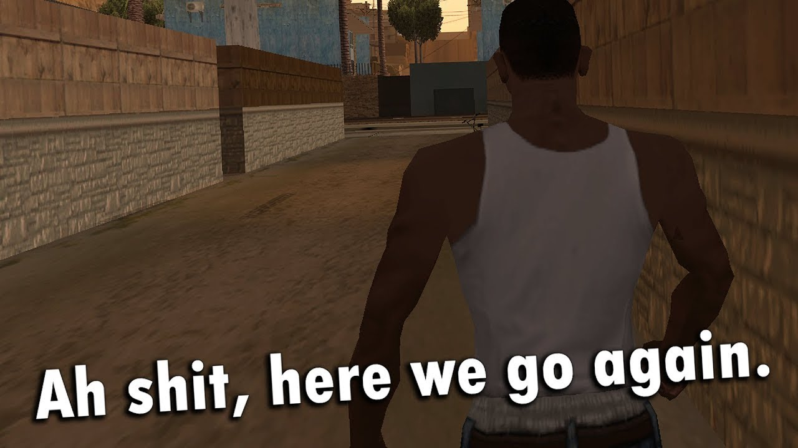

## Monday is bum day

On Mondays, couples are at a distance, so you can relax. I get up at 9 AM, connect to the lesson, and I myself go to the kitchen for food. After a hearty breakfast, you can play. I make the sound of the game quieter and calmly farm in the wonderful game Warfame.

After that, I clean the apartment and sit down at the farm again.

## Tuesday - something on sports

On Tuesday, we have only PE at 3 PM. Of course, there is still a lecture on computer algebra, but who would wake up to this lecture. Because PE in another building is also 15, and I live 2 hours round trip, then I have to leave the house at 12 AM. The main problem is that at this time we have a change of trains, which is why I cannot use this wonderful mode of transport in our city. I have to go on the 1055 bus, which goes to Odintsovo, from where I am already going on the electronic. So many people enter this bus that, sometimes, it seems that the metal will not stand it, and the bus will simply burst. Among this number of people, a large share is occupied by pensioners who always need to go to the market, although this can be done on other days of the week, but okay, it's not for me to decide.

I guessed up to one trick: you have to sit mainly from the edge in order to be "locked" and simply physically cannot give way.

Then PE: a warm-up, after which the legs hurt, and then playing basket, which worsen the situation.

By 8 PM I come home, have dinner, play a little and mentally prepare to get up at 5 AM in the morning.

## Who came up with Wednesday and Thursday......

In short, these are the only two days when couples start at 9 AM and I get up at 5 AM. It is on these days that I cross the sos with my friends from school, with whom I have the same schedule. Basically, this is Dima, sometimes Yegor also joins us. True, they need to be at the university by 8:30, so I'm going with them on the train at 6:59, which is why I come 30, and sometimes 40, minutes earlier.

I sleep for 3-4 hours these days.

## Friday!!!

On this day, I sleep off after the previous two days. Of the pairs for Friday: English and German - I don't want to go, but I have to. I go to the university by 13:30, study until 16:20, and then I go home, where I can sit down to play for hours until 5 AM, or I can do laboratory work on the os-intro, but I usually do it on Saturday.

## Saturday - Lab Day

I, in theory, should appear on the story, but I do it very rarely.

The moment is coming to make foreheads. I close myself in my room and record screencasts.

After 23:59 I am free, so again I can play on computer for hours until 5 AM.

## Sunday is the day of oblivion

On this day, I am as divorced from the university as possible, so there is a feeling that I am not studying anywhere and I dreamed of it all, but Sunday ends and I return to the harsh reality of the school week.

## Summing up

This is the week I get. Soon I plan to devote more time to study and healthy sleep.

Good luck, my dear reader!
