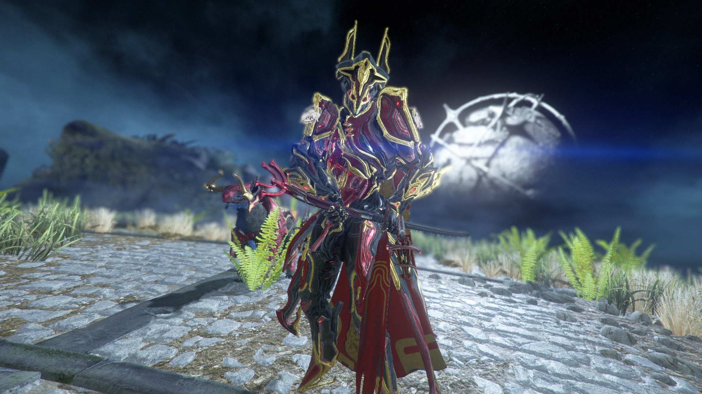

## Monday

Two weeks have passed since the last recording for the past week, I received Gauss Prime (check out the photo):

In addition to him, I also charged and pumped Revenant Prime. In short, this was fun.

## Tuesday - something on tired

Nothing interesting happened on Tuesday. Unless I came tired after PE.

## Wednesday and Thursday - I'm a Sleepy Fly

These days, nothing interesting happened (in fact, I am in a hurry to finish the project, because I have little time left, so I am too lazy to remember something).

## Friday - something on foreign

At night, the Internet was cut down, but instead of washing the dishes and going to bed, I hung up on my phone until 4 AM.

## Saturday - Lab Day

On Saturday, I decided to go to the story, because there was only one couple. I crossed into the subway with a very beautiful girl who tried to draw my attention to herself (she did it), but I was afraid to come up and get acquainted, because I am a fantastic fool.

## Sunday

All day I sat and played with a friend from Samara.

## Summing up

I did not begin to devote more time to study and sleep, but I began to engage in physical development.

Good luck, my dear reader!
