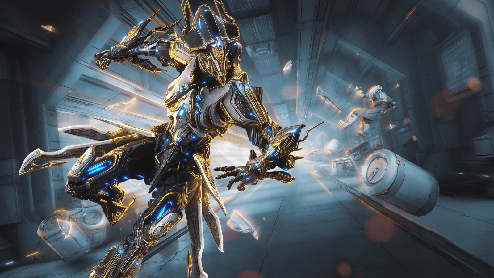

## Понедельник - день фарма

В понедельник я наконец-то закончил все задания для получения Экскалибура Умбра (потратил на это 3 дня) в Warframe. Зацените этого красавца:

Теперь я нацелен на Гаусса Прайм. Вот он:

## Вторник - что-то на уставшем

Во вторник не произошло ничего интересного. Разве что я приехал уставший после физры.

## Среда и четверг - я сонная муха

Мало того что в эти дни надо вставать в 5:20, так ещё и две контрольные(матлог и ангем) в четверг поставили. 
В среду я после пар поехал домой готовится к контрольным.
Четверг - судный день. Во-первых, в Одинцово порвался провод на станции, из-за чего мы с Димой, Егором и Лёхой час просидели на Пионерской, но посидели весело. Во-вторых, написали мы контрольные, и, по ощущениям, я очень недоволен ангемой, потому что у меня получались откровенно фиговые числа, из-за чего я много тупил и решил не всё. Контрольной по матлогу я более-менее доволен.

## Пятница - что-то на иностранном

Отоспавшись после двух тяжёлых дней, я отсидел две пары по иностранным языкам и поехал домой, где сидел и фармил до 5-ти утра.

## Суббота - день лаб

Сегодня я с 14-ти часов сижу и делаю лабы. На Историю я не пошёл, потому что не хочу.

## Воскресенье

День не открыт, купите подписку за 10$, чтобы открыть данный день недели.

## Подведение итогов

Больше времени учёбе и сну я не начал уделять, но начал заниматься физическим развитием.

Удачи тебе, мой дорогой читатель!
