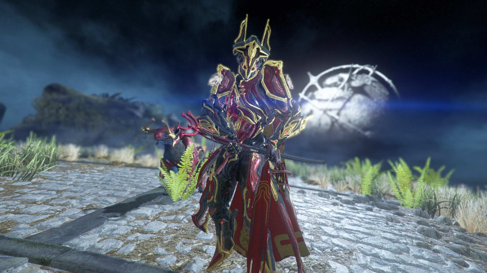

## Понедельник

Прошло две недели с момента последней записи по прошедшей недели, я получил таки Гаусса Прайм (зацените фоточку):

Помимо него я ещё нафармил и прокачал Ревенанта Прайм. Короче, весело

## Вторник - что-то на уставшем

Во вторник не произошло ничего интересного. Разве что я приехал уставший после физры.

## Среда и четверг - я сонная муха

В эти дни ничего интересного не произошло (на самом деле я спешу доделать проект, потому что времени у меня осталось мало, поэтому лень что-то вспоминать).

## Пятница - что-то на иностранном

Ночью вырубили интернет, но вместо того чтобы помыть посуду и пойти спать, я зависал в телефоне до 4-ёх утра

## Суббота - день лаб

В субботу я решил поехать на историю, т.к. там была только одна пара. Пересёкся в метро с очень красивой девушкой, которая пыталась обратить моё внимание на себя (у неё это получилось), но я побоялся подойти познакомится, потому что я великий аболтус.

## Воскресенье

Весь день я сидел и играл с другом из Самары

## Подведение итогов

Больше времени учёбе и сну я не начал уделять, но начал заниматься физическим развитием.

Удачи тебе, мой дорогой читатель!
