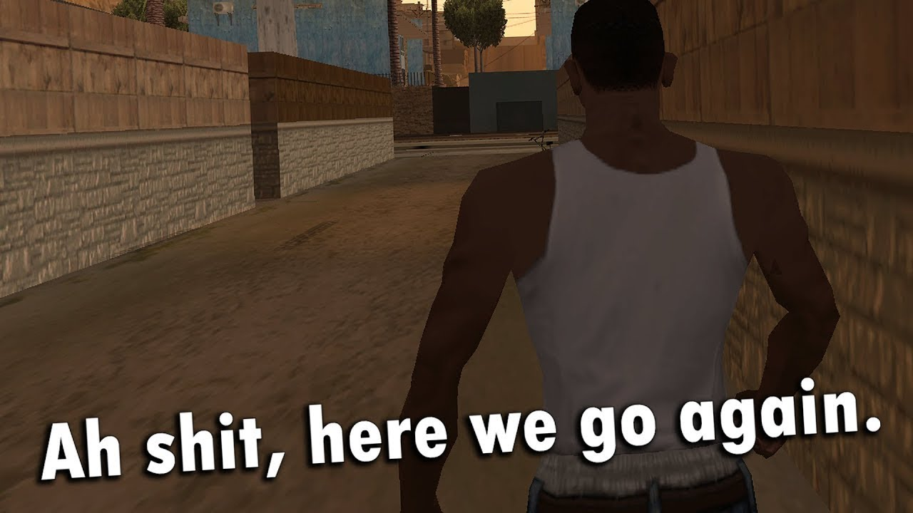

## Понедельник - день бездельник

По понедельникам пары у нас на дистанте, поэтому можно отдыхать. Встаю я в 9 утра, подключаюсь к занятию, а сам иду на кухню за едой. После плотного завтрака можно и поиграть. Делаю звук игры тише и спокойно фармлю в замечательной игре Warfame.

После этого я провожу уборку в квартире и снова сажусь за фарм.

## Вторник - что-то на спортивном

Во вторник у нас только физра в 15 часов. Конечно, ещё есть лекция по компалу, но кто бы просыпался на эту лекцию. Т.к. физра в другом корпусе так ещё и в 15, а живу я в 2-ух часах езды туда-обратно, то мне приходится выходить из дома в 12. Главная проблема состоит в том, что в это время у нас пересменка электричек, из-за чего я не могу воспользоваться этим прекрасным видом транспорта у нас в городе. Приходится идти на автобус 1055, который едет до Одинцово, откуда я уже еду на элекроне. В этот автобус заходит так много людей, что, порой, кажется что металл не выдержит, и автобус просто лопнет. Среди этого количества людей большую долю занимают пенсионеры, которым вечно надо ехать на рыночек, хотя это можно делать и в другие дни недели, но ладно, это не мне решать.

Я догадался до одной хитрости: надо садиться преимущественно с краю, чтобы оказаться "в заперти" и просто физически не смочь уступить место.

Потом физра: разминка, после которой болят ноги, а потом игры в баскет, которые ухудшают положение.

Часам к 8-ми вечера я приезжаю домой, ужинаю, немного играю и морально готовлюсь встать в 5 часов утра.

## Кто придумал среду и четверг......

Коротко говоря, это единственные два дня, когда пары начинаются в 9, а я встаю в 5. Именно в эти дни я пересекаюсь сос своими друзьями из школы, с которыми у меня совпадает расписание. В основном, это Дима, иногда Егор тоже к нам присоединяется. Правда, им к 8:30 надо быть в ВУЗе, поэтому я и еду с ними на электричке на 6:59, из-за чего приезжаю на 30, а, порой, и на 40, минут раньше. 

Сплю в эти дни я по 3-4 часа.

## Пятница!!!

В этот день я отсыпаюсь после предыдущих двух дней. Из пар на пятницу: английский и немецкий - Идти не хочется, но приходится. Еду в ВУЗ к 13:30, учусь до 16:20, а потом еду домой, где могу сесть поиграть часов до 5-ти утра, а могу сделать лабораторную работу по осям, но делаю я её, обычно, в суббботу.

## Суббота - день лаб

Я, по идее, должен появляться на истории, но делаю это очень редко.

Наступает момент делать лабы. Я закрываюсь в своей комнате и записываю скринкасты.

После 23:59 я свободен, поэтому опять же могу просидеть часов до 5-ти. 

## Воскресенье - день забвенья

В этот день я максимально оторван от университета, поэтому появляется ощущение, что я нигде не учусь и мне это всё приснилось, но воскресенье заканчивается и я возвращаюсь в суровую реальность учебной недели.

## Подведение итогов

Вот такая неделька у меня получается. В скором времени планирую больше времени уделять учёбе и здоровому сну.

Удачи тебе, мой дорогой читатель!
